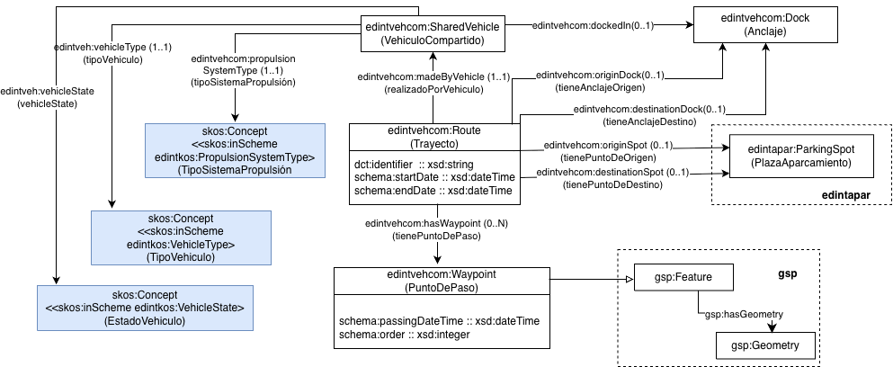
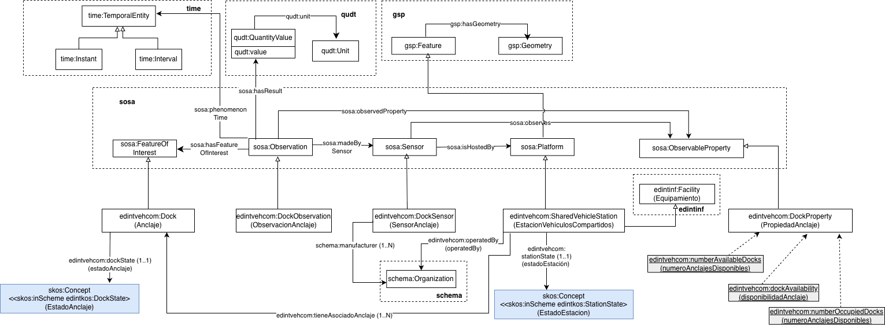

# Ontología de sistemas de vehículos compartidos (Shared vehicle systems ontology)

La ontología de sistemas de vehículos compartido representa los datos de los sistemas públicos y privados de vehículos compartidos en las ciudades, tales como bicicletas, patinetes, coches, etc.

# Propósito y alcance de la ontología (purpose and scope of the ontology)

La ontología de vehículos compartidos representa los datos de sistemas de vehículos compartidos. Los modelos de sistemas representados incluyen: (1)  Basados en estaciones con sensores en sus anclajes y (2) Libres, es decir aquellos sistemas que permiten que el vehículo se encuentre en algún lugar de aparcamiento permitido y que son ubicados a través de sus datos geoespaciales. 
Además, se representan datos de los trayectos realizados por estos vehículos incluyendo lu punto de origen y de destino.

# Prefijo y espacio de nombres de la ontología (Prefix and namespace of the ontology)

El prefijo de la ontología es: edintvehcom y se encuentra publicada en el espacio de nombres: [http://vocab.linkeddata.es/datosabiertos/def/transporte/vehiculos-compartidos#]([http://vocab.linkeddata.es/datosabiertos/def/urbanismo-infraestructuras/suministro#](http://vocab.linkeddata.es/datosabiertos/def/transporte/vehiculos-compartidos#) 

# Modelo conceptual de la ontología (Ontology conceptualization)

Modelo conceptual de vehículos y rutas

Modelo conceptual de estaciones, anclajes y sensores

# Estructura del repositorio (Repository structure)

El repositorio contiene los siguientes directorios:
| Carpeta | Descripción |
|--------|--------------|
| **diagrams/** | Contiene diagramas y otros recursos que representan el modelo conceptual de la ontología (por ejemplo, jerarquías de clases, relaciones). |
| **documentation/** | Contiene la documentación de la ontología y artefactos relacionados en formato HTML o dirigida a usuarios. |
| **kos/** | Contiene la implementación de vocabularios controlados o KOS, generalmente implementaciones SKOS en RDF.|
| **ontology/** | Contiene los archivos de implementación de la ontología en formatos como .owl, .rdf, .ttl o .jsonld |
| **requirements/** | Contiene todos los documentos utilizados para definir los requisitos de la ontología: ejemplos de datos, preguntas de competencia, requisitos funcionales, casos de uso, etc. |
| **shapes/** | Contiene las restricciones SHACL utilizad para validar datos respecto a la ontología.  |

# Mantenimiento del proyecto (Maintenance and evolution)

Para manejar las incidencias o mejoras sugeridas con respecto a la ontología, recomendamos seguir las guías proporcionadas en ([Issues Management](./ISSUES.md)) para generar una incidencia.

# Financiación (Funding)

Esta ontología ha sido desarrollada en el contexto del Espacio de Datos para las Infraestructuras Urbanas Inteligentes ([EDINT](https://edint.es/)). 

